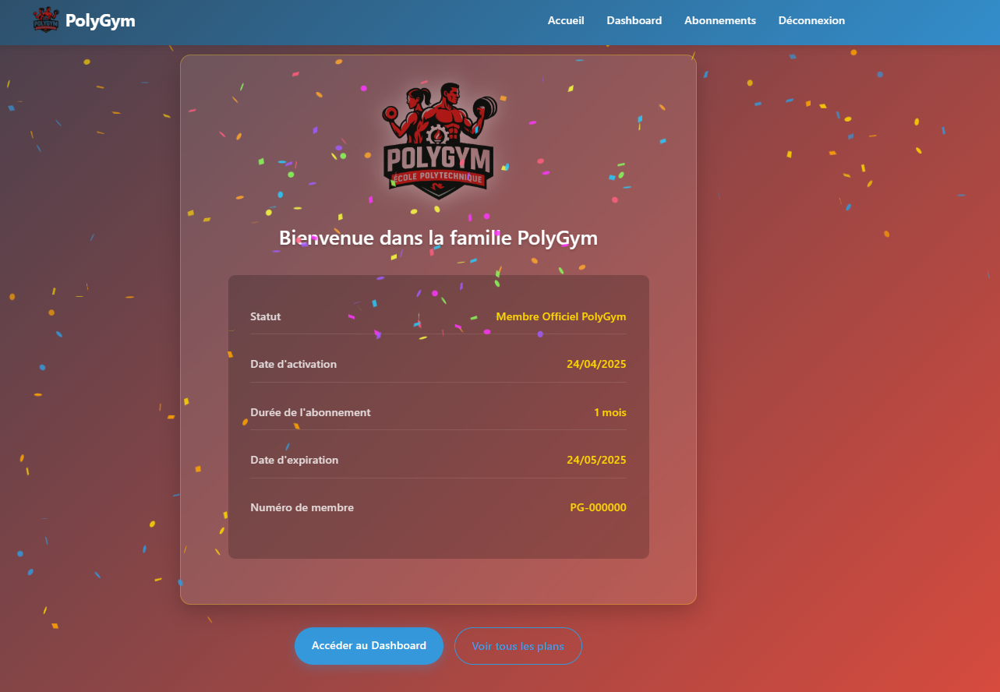

# PolyGym - Club de Fitness (Projet PHP & SQL)

<p align="center">
  
</p>

## À propos du projet

PolyGym est une application web développée en **PHP avec PDO** pour la gestion d'un club de fitness. Ce projet a été réalisé dans le cadre du cours de PHP & SQL sous la direction de M. Abdelweheb GUEDDES.

## Technologies utilisées

- **Backend**: PHP avec PDO pour les interactions avec la base de données
- **Base de données**: MySQL
- **Frontend**: HTML, CSS, Bootstrap
- **Authentification**: Système de connexion PHP

## Structure de la base de données

L'application gère trois tables principales avec relations:

1. **Membres** - Informations sur les adhérents du club
2. **Cours** - Détails des sessions d'entraînement proposées
3. **Inscriptions** - Table de relation entre membres et cours

## Fonctionnalités implémentées

### Opérations CRUD complètes
- **Create**: Ajout de nouveaux membres, cours et inscriptions
- **Read**: Consultation des informations (membres, planning des cours, etc.)
- **Update**: Modification des données existantes
- **Delete**: Suppression d'enregistrements

### Authentification utilisateur
- Connexion administrateur sécurisée
- Niveaux d'autorisation différents (admin, staff)

### Requêtes SQL avancées
- Jointures multiples pour afficher les données relationnelles
- Agrégations pour les statistiques
- Sous-requêtes pour des opérations complexes

### Interface utilisateur
- Design responsive avec Bootstrap
- Tableaux dynamiques pour l'affichage des données
- Formulaires interactifs pour la saisie et la modification

## Installation et configuration

1. Cloner le dépôt:
   ```
   git clone https://github.com/Kirazul/PolyGym.git
   ```

2. Configurer la base de données:
   - Créer une base de données MySQL
   - Importer le fichier SQL `database.sql`
   - Configurer le fichier de connexion dans `includes/config.php`

3. Déployer sur un serveur PHP (XAMPP, WAMP, etc.)

4. Accéder à l'application via: `http://localhost/PolyGym`

## Structure des fichiers

```
PolyGym/
├── assets/              # Images et ressources
├── css/                 # Feuilles de style CSS
├── includes/            # Fonctions PHP réutilisables
│   ├── auth.php         # Gestion de l'authentification
│   └── config.php       # Configuration BDD
├── database.sql         # Script d'initialisation de la BDD
├── index.php            # Page d'accueil
├── login.php            # Page de connexion
├── register.php         # Page d'inscription
├── dashboard.php        # Tableau de bord administrateur
├── payment.php          # Gestion des paiements
├── plans.php            # Affichage des forfaits disponibles
├── README.md            # Documentation du projet
└── .env.example         # Variables d'environnement d'exemple
```

## Captures d'écran

<p align="center">
  
</p>

## Évaluation du projet

### Exigences techniques:
- [x] Utilisation de PHP avec PDO
- [x] Gestion d'au moins 3 tables SQL avec relations
- [x] Implémentation des opérations CRUD
- [x] Authentification utilisateur
- [x] Requêtes SQL avancées
- [x] Interface avec Bootstrap

---

Made with ❤️ for a PHP & SQL School Project 